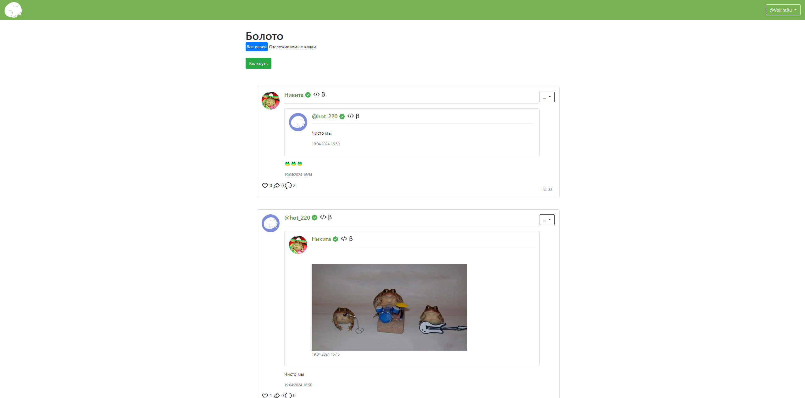

# Болото #

Соц. Сеть


 
<hr>

### Описание ### 
* На стартовой странице вебсайта можно увидеть все посты пользователей/свою ленту (если авторизован)
* У пользователя есть возможность просматривать ленту со всеми постами, просматривать профили пользователей
* Авторизованные пользователи могут видеть свою ленту, репостить и лайкать посты, создавать посты с загрузкой своих файлов, изменять профиль.
* Если пользователь не авторизован (или не зарегистрирован), нет доступа к:
  * Подпискам
  * Лайкам
  * Репостам
  * Собственной ленте
* Ему будет предложено авторизоваться (зарегистрироваться) при выполнении следующих действий:
  * Подписка
  * Лайк
  * Репост
  
<hr>

* На главной странице если пользователь авторизован:
  * Пользователь увидит ленту из своих подписок
  
  * А если подписки пусты, то все посты:
  
* Если пользователь не авторизован, он увидит все посты на платформе:
  

<hr>

* На странице авторизации нужно ввести логин и пароль, а так-же выбрать, запомнить-ли браузер.


<hr>

* На странице регистрации можно выбрать имя пользователя, он-же логин, и ввести пароль. 
  После нажатия кнопки будет создан аккаунт, в который сразу будет произведена авторизация

  
<hr>

* На странице пользователя можно посмотреть кол-во подписчиков и подписок, описание профиля,
  имя (отдельно от юзернейма) а так-же все посты этого пользователя

* Если пользователь авторизован, то он может подписаться
  

<hr>

(В разработке)
* Бот предназначен для ...  Команды бота ...  


<hr>

### Технологии в проекте ###

Приложение написано на языке программирования Python c использованием микро-фреймворка flask. 

В папке templates хранятся HTML-шаблоны. 
При создании форм используется объектный подход с помощью библиотеки flask-wtf.
Веб-приложение работает с базой данных через ORM sqlalchemy.

Все необходимые ресурсы хранятся в папке static. Собственные стили описаны в файле static/css/style.css.
Некоторые компоненты (например, панель навигации и кнопки) взяты как шаблоны bootstrap.

Регистрационные данные пользователей, хранятся 
в базе данных SQLite db/users.db
Пароли хранятся в БД в хешированном виде. 

<hr>

### Техническое описание проекта ###
Для запуска приложения необходимо запустить файл main.py  

Логин и пароль тестового юзера можно взять из db/пароли.txt

Для запуска бота: 
1. Зарегистрировать своего бота и получить API-TOKEN: ( https://core.telegram.org/bots/api )
2. Создать в проекте файл **.env** со следующим содержанием:

```
API_TOKEN=<YOU-API-TELEGRAM-TOKEN>
```

(Чтобы установить все зависимости 
достаточно в консоли (терминале) вызвать команду  
pip install -r requirements.txt)

Проект размещен в интернете по адресу: https://zhabki.ru/
