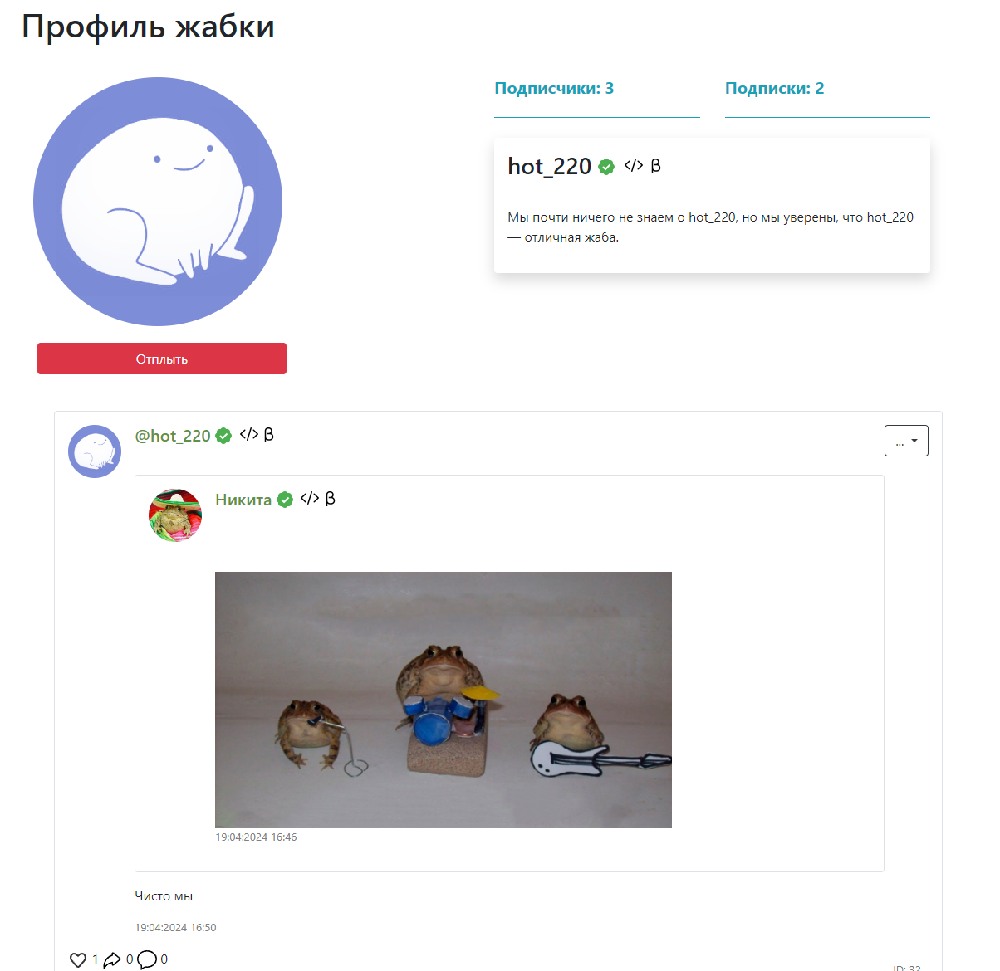

# Болото #

Соц. Сеть для жаб

 

### Описание ### 
* На стартовой странице вебсайта можно увидеть все посты пользователей/свою ленту (если авторизован)
* У пользователя есть возможность просматривать ленту со всеми постами, просматривать профили пользователей
* Авторизованные пользователи могут видеть свою ленту, репостить, лайкать и комментировать посты, создавать посты с загрузкой своих файлов, изменять профиль.
* Если пользователь не авторизован (или не зарегистрирован), нет доступа к:
  * Подпискам
  * Лайкам
  * Репостам
  * Собственной ленте
* Ему будет предложено авторизоваться (зарегистрироваться) при выполнении следующих действий:
  * Подписка
  * Лайк
  * Репост
  * Переход в ленту подписок
  

* На главной странице если пользователь авторизован:
  * Пользователь увидит две ленты. Одна со всеми постами, а вторая только с подписками
  

* На странице авторизации нужно ввести логин и пароль, а так-же выбрать, запомнить-ли браузер.

* На странице регистрации можно выбрать имя пользователя, он-же логин, и ввести пароль. 
  После нажатия кнопки будет создан аккаунт, в который сразу будет произведена авторизация

  

* На странице пользователя можно посмотреть кол-во подписчиков и подписок, описание профиля,
  имя (отдельно от юзернейма) а так-же все посты этого пользователя

* Если пользователь авторизован, то он может подписаться
  

* На странице c подписками можно посмотреть всех пользователей на которых вы подписаны и здесь-же отписаться

* Если пользователь авторизован, то он может подписаться
  

### Фишки ###

* Бот
  * Предназначен для модерации проекта. С помощью его наша команда получает жалобы на посты, а так-же может их удалять прямо через бот.

    
* Система значков
  * На сайте присутствует система значков. Значок показывает ваше место на болоте. Пока существуют 3 типа значков:
  * Подтверждённый аккаунт
  
  * Разработчик
  
  * Бета тестировщик
  
  * Все значки:
  

### Технологии в проекте ###

Приложение написано на языке программирования Python c использованием микро-фреймворка flask. 

Папки:
* В templates хранятся HTML-шаблоны. 
* В forms хранятся .py файлы с различными формами. 
  * При создании форм используется объектный подход с помощью библиотеки flask-wtf.
* В db хранятся база данных. 
* В data хранятся .py файлы модулей БД. 
  * Веб-приложение работает с базой данных через ORM sqlalchemy.
* В static хранятся: 
  * Файлы пользователей, загруженные на платформу
  * Стандартные аватары
  * Другие медиа файлы использующиеся на сайте
  * css файлы
  
Некоторые компоненты (например, панель навигации и кнопки) взяты как шаблоны bootstrap.

Регистрационные данные пользователей, хранятся 
в базе данных SQLite db/users.db
Пароли хранятся в БД в хешированном виде. 

### Техническое описание проекта ###
Для запуска приложения необходимо:
1. Изменить в проекте файл **example.env** и поле переименовать в **.env**
2. Запустить файл main.py

Для запуска бота: 
1. Зарегистрировать своего бота и получить API-TOKEN: (https://discord.com/developers/applications/)
2. Изменить в проекте файл **example.env** и поле переименовать в **.env**

(Чтобы установить все зависимости 
достаточно в консоли (терминале) вызвать команду
pip install -r requirements.txt)

Проект размещен в интернете по адресу: https://zhabki.ru/
